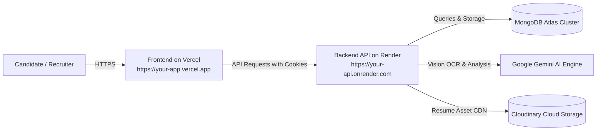

# 🚀 AI Resume Analyzer & Job Matching Engine

A production-grade full-stack platform that evaluates resumes, computes deterministic 6-pillar ATS compatibility scores, runs deep AI candidate evaluations using Google Gemini (`gemini-3.6-flash`), generates targeted role matches with missing skills detection, and exports pixel-perfect multi-page vector PDF reports.

---

## 🌟 Key Features

- 🔐 **Secure Authentication**: JWT Access Tokens (15m) + `httpOnly`, `SameSite=None; Secure` Refresh Tokens (7d) with token rotation.
- 📄 **Multi-Format Extraction & AI Vision OCR**: Native parsing for `.pdf` and `.docx` with automatic Google Gemini Multimodal Vision OCR fallback for scanned/image-only resumes.
- 📊 **Deterministic 6-Pillar ATS Scoring Engine**: 100-point transparent rating across Keywords & Skills (0–25), Section Structure (0–20), Contact Details (0–15), Action Verbs (0–15), Quantified Impact (0–15), and Formatting (0–10).
- 🎯 **Targeted Job Matching UI (`/job-match`)**: Paste any job description to compare candidate compatibility, identify missing skills, and calculate a weighted composite match score.
- 📈 **Interactive Candidate Dashboard & Reports (`/analysis/:id`)**: Executive recruiter summaries, detected vs. missing skills, itemized strengths & weaknesses, actionable AI recommendations, and section-by-section ratings.
- 📄 **Vector PDF Report Generation**: Native vector PDF export (`GET /api/analysis/:id/report`) powered by `pdfkit` with dynamic pagination, branded metrics, and disclaimers.
- 🛡️ **Hardened Production Security**: Helmet HTTP security headers, locked strict CORS origin verification, global and route-specific rate limiting, NoSQL injection defenses, and strict Zod validation.
- 🧪 **Full-Stack CI/CD Testing**: 34 passing tests covering Backend (Jest + Supertest) and Frontend (Vitest + React Testing Library).

---

## 🛠️ Tech Stack

- **Frontend**: React 19, TypeScript, Vite, Tailwind CSS, React Router v6, Axios.
- **Backend**: Node.js, Express, TypeScript, Mongoose, Multer, PDFKit, pdf-parse, mammoth.
- **AI & OCR Engine**: Google Gemini API (`@google/generative-ai` with `gemini-3.6-flash`).
- **Database & Storage**: MongoDB Atlas, Cloudinary (with local fallback storage).
- **Testing**: Jest, Supertest, Vitest, React Testing Library, jsdom.

---

## 📦 Project Structure

```text
├── client/                     # React + Vite Frontend
│   ├── src/
│   │   ├── components/         # Navbar, FileDropzone, ProtectedRoute, AnalyzeModal
│   │   ├── context/            # AuthContext (JWT + cookie state)
│   │   ├── pages/              # Landing, Login, Register, Dashboard, JobMatch, AnalysisDetails, History
│   │   ├── services/api/       # Axios API clients (auth, resume, job, analysis)
│   │   └── types/              # Full TypeScript contracts
│   ├── vercel.json             # Vercel SPA routing rewrites
│   └── package.json
├── server/                     # Node.js + Express Backend
│   ├── src/
│   │   ├── config/             # Environment & MongoDB configuration (fail-fast checks)
│   │   ├── controllers/        # Auth, Resume, Job, and Analysis controllers
│   │   ├── middleware/         # Auth, Helmet, CORS, Error, Rate limiting, Multer upload
│   │   ├── models/             # User, Resume, JobDescription, Analysis schemas
│   │   ├── routes/             # API routing endpoints
│   │   ├── services/           # AI service, ATS scoring, PDF report generator, Storage
│   │   └── validators/         # Strict Zod schemas (Auth, Job, Analysis, AI)
│   ├── tests/                  # Jest test suites (auth, resume, analysis, authorization)
│   └── package.json
├── SECURITY.md                 # Security architecture & threat model
└── README.md                   # Full documentation & deployment guide
```

---

## 💻 Local Development Setup

### 1. Prerequisites
- Node.js (v18+)
- MongoDB (Local or MongoDB Atlas cluster)
- Google Gemini API Key ([Google AI Studio](https://aistudio.google.com/))

### 2. Backend Setup
```bash
cd server
npm install

# Copy environment template
cp .env.example .env

# Configure server/.env:
# - MONGODB_URI=mongodb://localhost:27017/ai-resume-analyzer (or Atlas URI)
# - JWT_SECRET=your_jwt_secret_min_32_characters
# - AI_API_KEY=your_gemini_api_key

npm run dev
# Server running at http://localhost:5000
```

### 3. Frontend Setup
```bash
cd client
npm install

# Copy environment template
cp .env.example .env

# Configure client/.env:
# - VITE_API_BASE_URL=http://localhost:5000/api

npm run dev
# App running at http://localhost:5173
```

---

## 🚢 Production Deployment Guide

Follow these exact steps to deploy your application to production:



---

### Step 1: Set Up MongoDB Atlas Database
1. Go to [MongoDB Atlas](https://www.mongodb.com/cloud/atlas) and create a free Shared Cluster (`M0`).
2. Under **Security > Database Access**:
   - Create a database user (e.g. `resume_app_user`) with a strong password.
3. Under **Security > Network Access**:
   - Add IP Address: `0.0.0.0/0` (Allow access from anywhere, so Render can connect).
4. Under **Database > Deployment > Connect**:
   - Choose **Connect your application** (Driver: Node.js).
   - Copy your connection string:
     ```text
     mongodb+srv://resume_app_user:<password>@cluster0.xxxxx.mongodb.net/ai-resume-analyzer?retryWrites=true&w=majority
     ```

---

### Step 2: Set Up Cloudinary (Cloud File Storage)
1. Sign up for a free account at [Cloudinary](https://cloudinary.com/).
2. On your Cloudinary Dashboard, copy:
   - **Cloud Name**
   - **API Key**
   - **API Secret**

---

### Step 3: Deploy Backend to Render
1. Go to [Render](https://render.com/) and click **New + > Web Service**.
2. Connect your GitHub repository.
3. Configure the Web Service settings:
   - **Name**: `ai-resume-analyzer-api`
   - **Root Directory**: `server`
   - **Environment**: `Node`
   - **Build Command**: `npm install && npm run build`
   - **Start Command**: `npm start`
4. Under **Environment Variables**, add the following:

| Variable Name | Recommended Value / Description |
| :--- | :--- |
| `NODE_ENV` | `production` |
| `PORT` | `10000` (or leave default, Render injects `PORT`) |
| `CLIENT_URL` | `https://your-app.vercel.app` *(Your Vercel URL from Step 4)* |
| `MONGODB_URI` | `mongodb+srv://...` *(Atlas connection string from Step 1)* |
| `JWT_SECRET` | *(Random 32+ character string, e.g. `openssl rand -base64 32`)* |
| `JWT_REFRESH_SECRET` | *(Distinct random 32+ character string)* |
| `AI_PROVIDER` | `gemini` |
| `AI_API_KEY` | *(Your Google AI Studio Gemini API Key)* |
| `GEMINI_MODEL` | `gemini-3.6-flash` |
| `CLOUDINARY_CLOUD_NAME` | *(Your Cloudinary Cloud Name)* |
| `CLOUDINARY_API_KEY` | *(Your Cloudinary API Key)* |
| `CLOUDINARY_API_SECRET` | *(Your Cloudinary API Secret)* |

5. Click **Create Web Service**. Once deployed, copy your Render URL (e.g. `https://ai-resume-analyzer-api.onrender.com`).

---

### Step 4: Deploy Frontend to Vercel
1. Go to [Vercel](https://vercel.com/) and click **Add New... > Project**.
2. Import your GitHub repository.
3. Configure the Project settings:
   - **Framework Preset**: `Vite`
   - **Root Directory**: `client`
   - **Build Command**: `npm run build`
   - **Output Directory**: `dist`
4. Under **Environment Variables**, add:

| Variable Name | Value |
| :--- | :--- |
| `VITE_API_BASE_URL` | `https://ai-resume-analyzer-api.onrender.com/api` *(Render API URL from Step 3 + `/api`)* |

5. Click **Deploy**. Vercel will build and deploy your frontend to `https://your-app.vercel.app`.

---

### Step 5: Final Cross-Origin & Cookie Sync
1. Go back to your **Render Dashboard** for the backend service.
2. In **Environment Variables**, verify that `CLIENT_URL` matches your exact Vercel production domain (e.g. `https://your-app.vercel.app`).
3. Trigger a **Manual Deploy > Clear build cache & deploy** on Render.
4. Open your Vercel URL in your browser:
   - Register an account.
   - Upload resumes.
   - Match jobs and download PDF reports!

---

## 🧪 Automated Testing

Run the full CI/CD test suite locally:

```bash
# Run Backend Tests (Jest + Supertest + MongoDB)
cd server
npm test

# Run Frontend Tests (Vitest + React Testing Library)
cd ../client
npm test
```

---

## 📄 License
MIT License. Built for candidates and hiring teams worldwide.
