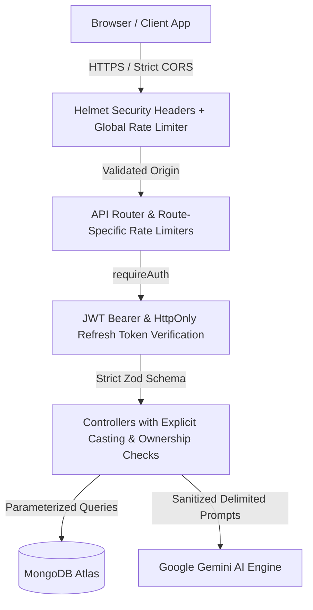

# Security Policy & Architecture Guide

This document outlines the security architecture, threat model, protective controls, and hardening policies implemented across the **AI Resume Analyzer & Job Matching Platform**.

---

## 1. Security Architecture & Threat Model

---

## 2. Security Controls & Defenses

### A. HTTP Security Headers & Transport Protection (`Helmet`)
- **Helmet Middleware**: Integrated globally in [`server/src/app.ts`](file:///c:/Users/sanja/OneDrive/Desktop/project1/server/src/app.ts).
- Sets industry-standard security headers:
  - `X-Content-Type-Options: nosniff` (Prevents MIME sniffing attacks).
  - `X-Frame-Options: SAMEORIGIN` (Prevents clickjacking).
  - `Strict-Transport-Security` (HSTS enforcement).
  - `Cross-Origin-Resource-Policy: cross-origin` (Allows authenticated frontend assets and PDF streams).

### B. Cross-Origin Resource Sharing (CORS) Isolation
- Locked strictly to `CLIENT_URL` (default: `http://localhost:5173`) in all environments.
- Wildcards (`*`) are explicitly prohibited.
- Origin validation callback returns `403 Forbidden` (`CORS_ORIGIN_DENIED`) for untrusted web origins while permitting server-to-server and mobile agent calls.

### C. Rate Limiting & Denial-of-Service (DoS) Mitigation
- **Global Rate Limiter**: 300 requests per 15 minutes per IP applied globally across `/api`.
- **AI Analysis Limiter**: 10 analysis generations per hour per authenticated user on `POST /api/analysis`.
- **PDF Report Download Limiter**: 30 downloads per hour per authenticated user on `GET /api/analysis/:id/report`.
- **Payload Limits**: `express.json({ limit: '1mb' })` and `express.urlencoded({ limit: '1mb' })` prevent memory allocation attacks.

### D. NoSQL Injection & Query Parameterization
- **Strict ID Validation & Casting**: All route parameters and database queries explicitly validate hex format via `mongoose.Types.ObjectId.isValid(id)` and cast using `new mongoose.Types.ObjectId(userId)`.
- **No Raw Body Spreading**: No controller passes unvalidated `req.body` directly into Mongoose filters or queries.
- **Strict Data Ownership Checks**: Every document lookup (`Resume`, `JobDescription`, `Analysis`) asserts `doc.userId.toString() === req.userId`, preventing Insecure Direct Object References (IDOR) with `403 Forbidden`.

### E. Input Validation & Strict Schema Enforcement (`Zod`)
- All incoming payloads are validated through **strict** Zod schemas (`registerSchema`, `loginSchema`, `createJobSchema`, `createAnalysisSchema`, `aiAnalysisResultSchema`).
- Unknown or unexpected input properties are stripped/rejected (`.strict()`).

### F. File Upload & Document Processing Security
- **MIME & Extension Whitelist**: Multer rejects any file not in `{ .pdf, .docx }` and `{ application/pdf, application/vnd.openxmlformats-officedocument.wordprocessingml.document, application/msword }`.
- **Memory Buffer Isolation**: Uploads stream to memory storage without saving unverified temporary files to the disk.
- **Compensating Rollback**: If database creation fails after upload, the uploaded storage asset is deleted automatically.
- **Prompt Injection Delimiters**: AI prompt templates isolate extracted resume text within dedicated multi-character boundary tags (`<<<RESUME_TEXT_START>>> ... <<<RESUME_TEXT_END>>>`).

### G. Cross-Site Scripting (XSS) & Content Security
- **React Escaped Rendering**: Extracted resume text, candidate names, recruiter summaries, and AI recommendations are rendered exclusively through standard React DOM text nodes.
- **Zero Raw HTML Injection**: Audit confirmed **0 instances** of `dangerouslySetInnerHTML` across the client codebase.

### H. Authentication & Credential Security
- **Password Hashing**: Passwords are encrypted with `bcrypt` using 12 salt rounds.
- **JWT Architecture**:
  - Short-lived Access Tokens (15 minutes).
  - Long-lived Refresh Tokens (7 days) stored in `httpOnly`, `sameSite: 'lax'`, secure cookies.
  - Refresh token rotation on each refresh request.
- **Information Leakage Prevention**:
  - `stack` traces are suppressed in production responses (`NODE_ENV === 'production'`).
  - Passwords and secret keys are never included in console logs or error payloads.

---

## 3. Security Verification Checklist

| Security Control | Implementation File | Status |
| :--- | :--- | :--- |
| **HTTP Security Headers (Helmet)** | `server/src/app.ts` |  Verified |
| **Strict Origin CORS Locking** | `server/src/app.ts` |  Verified |
| **Global + Route Rate Limiting** | `server/src/app.ts`, `analysis.routes.ts` |  Verified |
| **NoSQL Injection Defenses** | Controllers (`analysis`, `resume`, `job`, `auth`) |  Verified |
| **Strict Zod Input Validation** | `server/src/validators/*.validator.ts` |  Verified |
| **Dual File Upload Validation** | `server/src/middleware/upload.middleware.ts` |  Verified |
| **Zero dangerouslySetInnerHTML** | `client/src/**/*.tsx` |  Verified |
| **Production Stack Trace Suppression** | `server/src/middleware/error.middleware.ts` |  Verified |
| **Safe Logging (No Credential Leakage)** | Entire `server/src` tree |  Verified |
